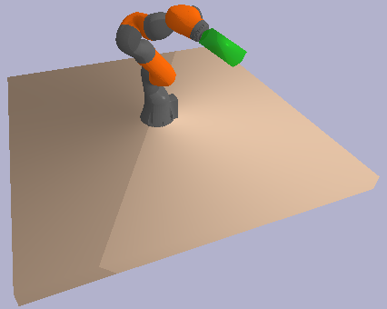
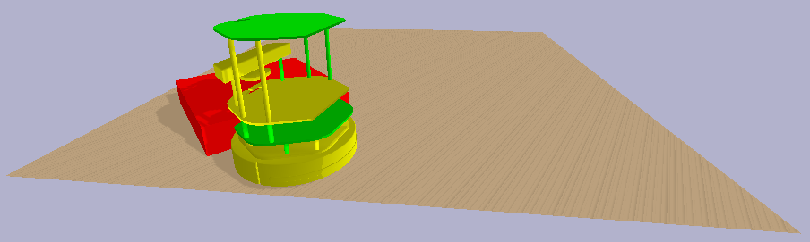
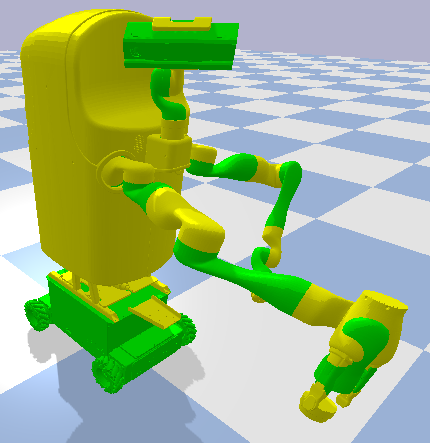

# ss-pybullet
STRIPStream + pybullet

<!---->
<!--img src="images/pr2.png" height="300">&emsp;

## Installation

Install PyBullet on OS X or Linux using: 
```
$ pip install numpy pybullet
$ git clone https://github.com/caelan/ss-pybullet.git
$ cd ss-pybullet
$ git submodule update --init --recursive
```

## Tests

1) Test pybullet - ```python -c 'import pybullet'```

## Examples

Examples:
* Kuka IIWA pick planning - ```$ python -m examples.test_kuka_pick```
* PR2 motion planning - ```$ python -m examples.test_pr2_motion```
* PR2 teleoperation - ```$ python -m examples.teleop_pr2```
* PR2 visibility - ```$ python -m examples.test_visibility```
* PR2 copying - ```$ python -m examples.test_clone```
* TurtleBot collisions - ```$ python -m examples.test_turtlebot```
* MOVO random configurations - ```$ python -m examples.test_movo```
* Dropping beads - ```$ python -m examples.test_water```

&emsp;

## PDDLStream Examples

See the following examples: https://github.com/caelan/pddlstream/tree/master/examples/pybullet

[](https://www.youtube.com/watch?v=3HJrkgIGK7c)
[](https://www.youtube.com/watch?v=oWr6m12nXcM)

## PyBullet Resources
* pip - https://pypi.python.org/pypi/pybullet
* Quickstart - https://docs.google.com/document/d/10sXEhzFRSnvFcl3XxNGhnD4N2SedqwdAvK3dsihxVUA/
* Forum - https://pybullet.org/Bullet/phpBB3/
* Wordpress - https://pybullet.org/wordpress/
* Examples - https://github.com/bulletphysics/bullet3/tree/master/examples/pybullet/examples

## Bullet Resources
* Github - https://github.com/bulletphysics/bullet3
