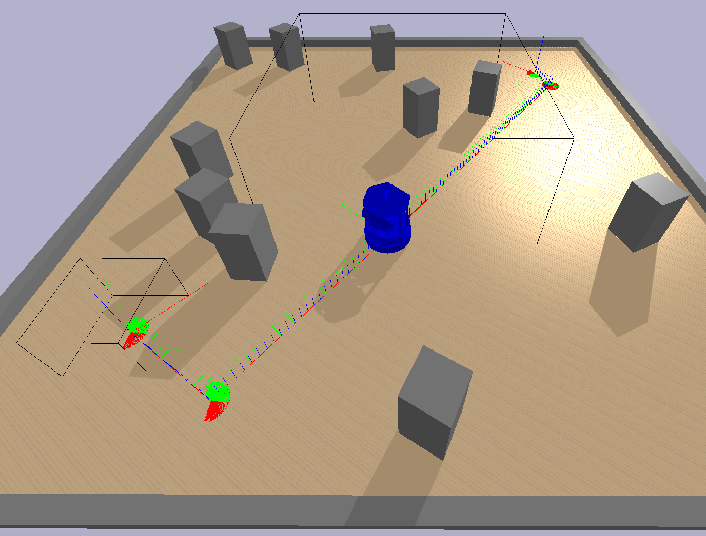
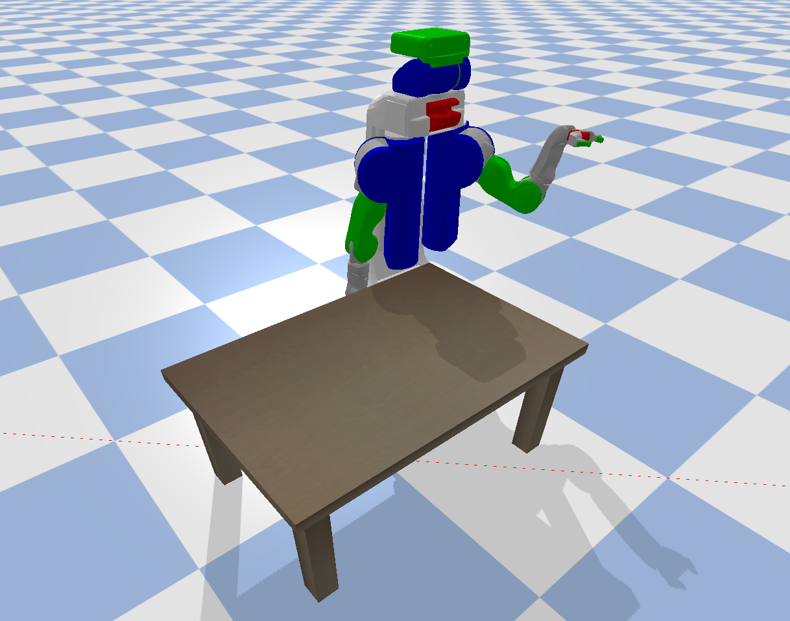
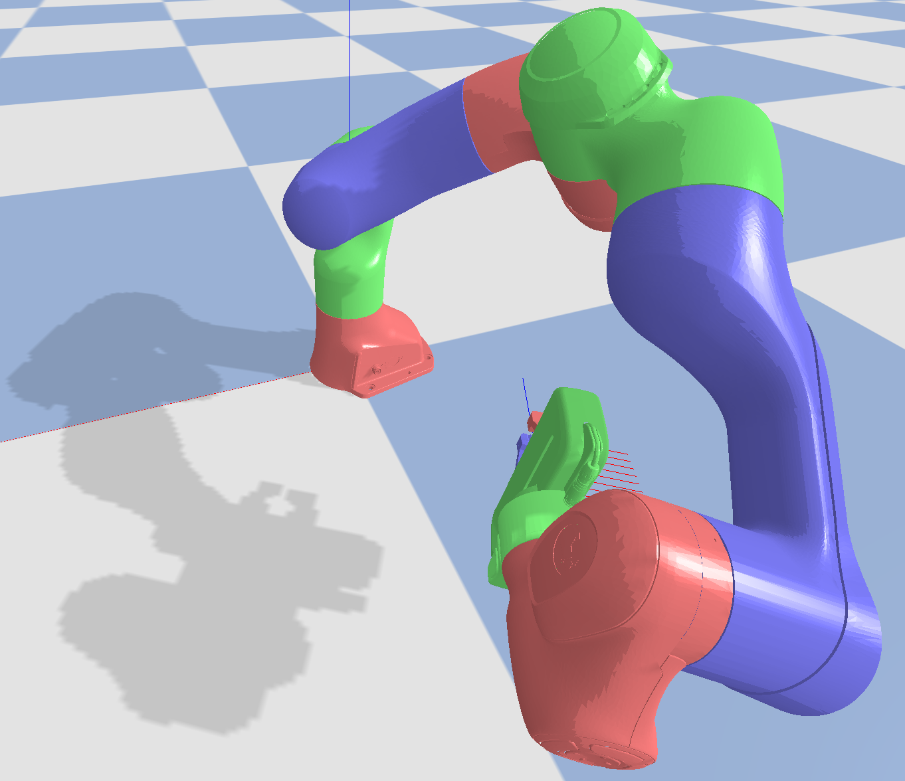
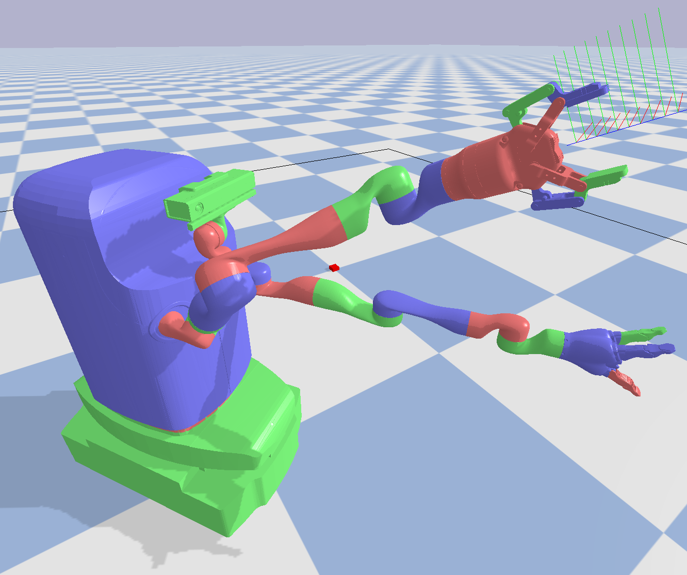
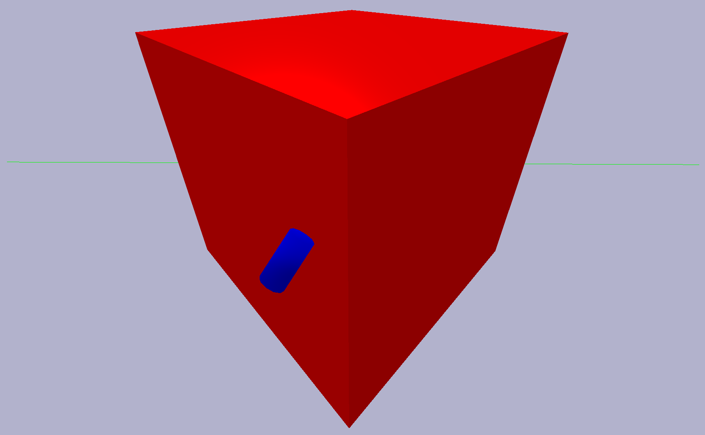
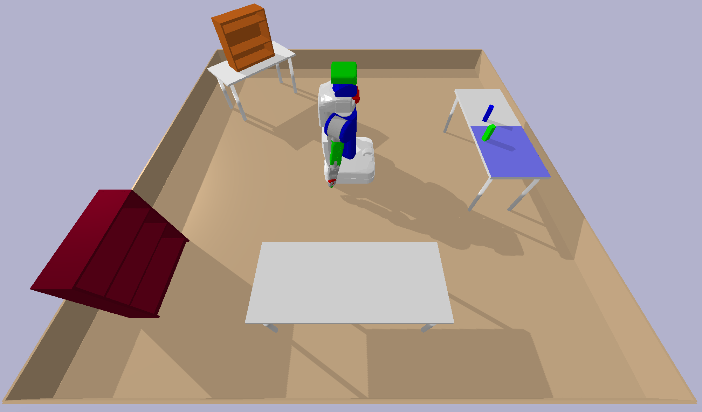
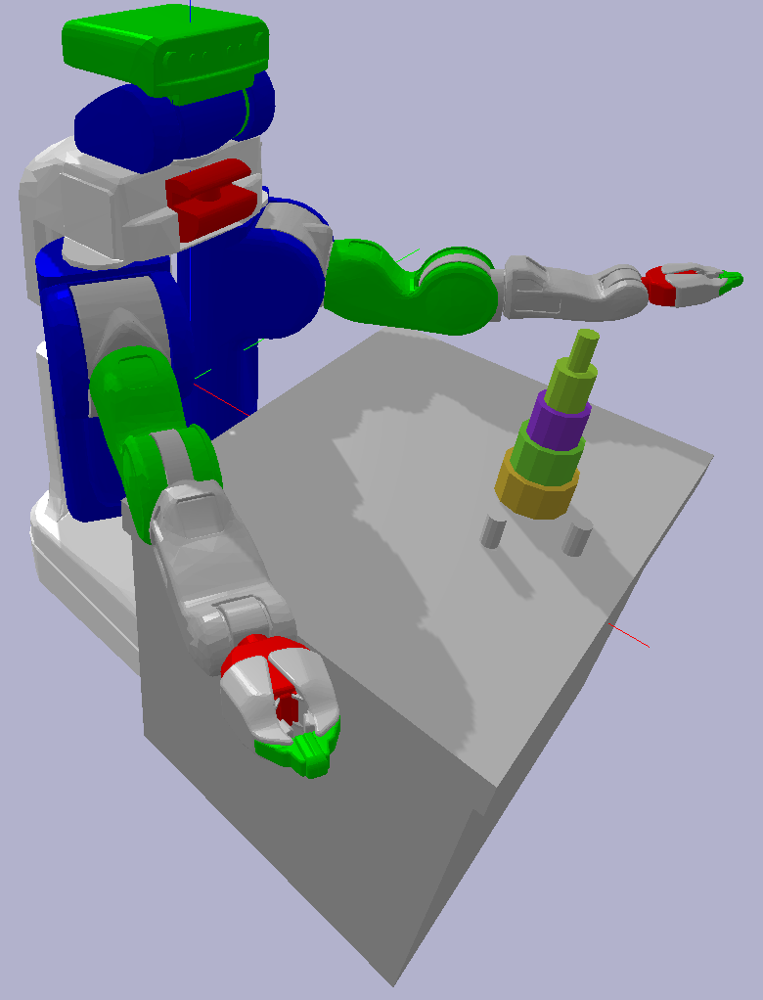
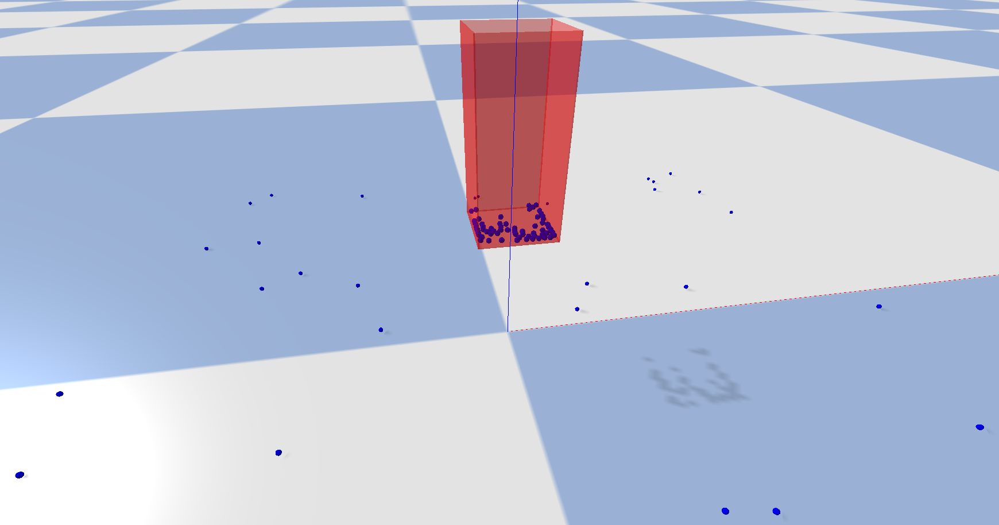

# pybullet-planning (previously ss-pybullet)

A repository of [PyBullet](https://pypi.python.org/pypi/pybullet) utility functions for robotic motion planning, manipulation planning, and task and motion planning (TAMP).
This repository was originally developed for the [PDDLStream](https://github.com/caelan/pddlstream) (previously named [STRIPStream](https://github.com/caelan/stripstream)) approach to TAMP.

<!---->
<!--img src="images/pr2.png" height="300">&emsp;

<!-- ## PyBullet Planning -->

With the help of [Yijiang Huang](https://github.com/yijiangh), a stable and documented fork of **pybullet-planning** named [pybullet_planning](https://github.com/yijiangh/pybullet_planning) is available through [PyPI](https://pypi.org/project/pybullet-planning/).
However, new features will continue to be introduced first through **pybullet-planning**.

## Citation

Caelan Reed Garrett. PyBullet Planning. https://pypi.org/project/pybullet-planning/. 2018.

## Installation

Install for macOS or Linux using: 
```
$ git clone --recurse-submodules https://github.com/caelan/pybullet-planning.git
pybullet-planning$ cd pybullet-planning
pybullet-planning$ git pull --init --recurse-submodules
pybullet-planning$ pip install -r requirements.txt
```

<!--
Install PyBullet on OS X or Linux using: 
```
$ pip install numpy pybullet
$ git clone --recurse-submodules https://github.com/caelan/ss-pybullet.git
$ cd ss-pybullet
$ git pull --recurse-submodules
```
-->

**pybullet-planning** is intended to have ongoing support for both python2.7 and python3.*

Make sure to recursively update **pybullet-planning**'s submodules when pulling new commits.
```
pybullet-planning$ git pull --recurse-submodules
```

## IKFast Compilation

We recommend using [IKFast](http://openrave.org/docs/0.8.2/openravepy/ikfast/), an analytical inverse kinematics solver, instead of PyBullet's damped least squares solver.
IKFast bindings are included for the following robots:
* Franka Panda - `$ cd pybullet-pybullet/pybullet_tools/ikfast/franka_panda; python setup.py`
* MOVO - `$ cd pybullet-pybullet/pybullet_tools/ikfast/movo; python setup.py`
* PR2 - `$ cd pybullet-pybullet/pybullet_tools/ikfast/pr2; python setup.py`

To create IKFast bindings for a new robot, following the instructions in [ikfast_pybind](https://github.com/yijiangh/ikfast_pybind). 

<!-- https://pypi.org/project/ikfast-pybind/ -->

## Tests

1) Test pybullet - ```python -c 'import pybullet'```

## Tutorial

[test_turtlebot](https://github.com/caelan/pybullet-planning/blob/master/examples/test_turtlebot.py) - ```$ python -m examples.test_turtlebot```


<!--img src="images/turtlebot2.png" height="150"-->

Heavily annotated simple example that demonstrates:
* Creating a PyBullet simulation
* Waiting for user input (useful on macOS)
* Programmatically creating objects
* Getting/setting object base poses
* Loading a robot [URDF](http://wiki.ros.org/urdf)
* Getting/setting robot joint positions
* Looking up named robot links and joints
* Computing an object's current Axis-Aligned Bounding Box (AABB)
* Drawing coordinate frames and bounding boxes
* Checking collisions between two objects
* Temporarily disabling rendering for efficiency purposes

## Planning Examples

* [Kuka IIWA pick motion planning](https://github.com/caelan/pybullet-planning/blob/master/examples/test_kuka_pick.py) - `$ python -m examples.test_kuka_pick`
* [TutleBot base motion planning](https://github.com/caelan/pybullet-planning/blob/master/examples/test_turtlebot_motion.py) - ```$ python -m examples.test_turtlebot_motion```
* [PR2 base & arm motion planning](https://github.com/caelan/pybullet-planning/blob/master/examples/test_pr2_motion.py) - ```$ python -m examples.test_pr2_motion```
* [Franka Panda workspace planning](https://github.com/caelan/pybullet-planning/blob/master/examples/test_franka.py) - ```$ python -m examples.test_franka```
* [Kinova MOVO workspace planning](https://github.com/caelan/pybullet-planning/blob/master/examples/test_movo.py) - ```$ python -m examples.test_movo```
* [Cylinder SE(3) motion planning](https://github.com/caelan/pybullet-planning/blob/master/examples/test_se3.py) - ```$ python -m examples.test_se3```
* [PR2 teleoperation](https://github.com/caelan/pybullet-planning/blob/master/examples/teleop_pr2.py) - ```$ python -m examples.teleop_pr2```

<!--img src="images/movo.png" height="150"-->
&emsp;
&emsp;

&emsp;
&emsp;

## Debug Examples

* [TAMP environments](https://github.com/caelan/pybullet-planning/blob/master/examples/test_json.py) - ```$ python -m examples.test_json```
* [TAMP benchmarks](https://github.com/caelan/pybullet-planning/blob/master/examples/test_tamp_xml.py) - ```$ python -m examples.test_tamp_xml```
* [Gripper side grasps](https://github.com/caelan/pybullet-planning/blob/master/examples/gripper/test_side.py) - ```$ python -m examples.gripper.test_side```
* [Gripper top grasps](https://github.com/caelan/pybullet-planning/blob/master/examples/gripper/test_top.py) - ```$ python -m examples.gripper.test_top```
* [Dropping particles](https://github.com/caelan/pybullet-planning/blob/master/examples/test_water.py) - ```$ python -m examples.test_water```
* [PR2 cloning](https://github.com/caelan/pybullet-planning/blob/master/examples/test_clone.py) - ```$ python -m examples.test_clone```

&emsp;
&emsp;
<!--&emsp;
&emsp;

<!--
* [OpenRAVE bodies](https://github.com/caelan/pybullet-planning/blob/master/examples/test_kinbody.py) - ```$ python -m examples.test_kinbody```
* [Kiva shelves](https://github.com/caelan/pybullet-planning/blob/master/examples/test_kiva.py) - ```$ python -m examples.test_kiva```
* [LIS/YCB models](https://github.com/caelan/pybullet-planning/blob/master/examples/test_models.py) - ```$ python -m examples.test_models```
* [PR2 visibility](https://github.com/caelan/pybullet-planning/blob/master/examples/test_visibility.py) - ```$ python -m examples.test_visibility```
* [TurtleBot collisions](https://github.com/caelan/pybullet-planning/blob/master/examples/test_turtlebot.py) - ```$ python -m examples.test_turtlebot```
-->

## PDDLStream Examples

See the following examples: https://github.com/caelan/pddlstream/tree/master/examples/pybullet

[](https://www.youtube.com/watch?v=3HJrkgIGK7c)
[](https://www.youtube.com/watch?v=oWr6m12nXcM)

## Forks

* https://github.com/yijiangh/pybullet_planning
* https://github.com/rachelholladay/pb_robot
* https://github.com/mike-n-7/pb_robot
* https://github.com/carismoses/pb_robot

## Gallery

* PDDLStream for TAMP - https://github.com/caelan/pddlstream
* Online TAMP under Partial Observability - https://github.com/caelan/SS-Replan
* Automated Construction - https://github.com/caelan/pb-construction
* Learning + TAMP (LTAMP) - https://github.com/caelan/LTAMP

## PyBullet Resources

* PyPI - https://pypi.python.org/pypi/pybullet
* Quickstart - https://docs.google.com/document/d/10sXEhzFRSnvFcl3XxNGhnD4N2SedqwdAvK3dsihxVUA/
* Forum - https://pybullet.org/Bullet/phpBB3/
* Wordpress - https://pybullet.org/wordpress/
* Examples - https://github.com/bulletphysics/bullet3/tree/master/examples/pybullet/examples
* Bindings - https://github.com/bulletphysics/bullet3/blob/master/examples/pybullet/pybullet.c

## Bullet Resources

* GitHub - https://github.com/bulletphysics/bullet3
